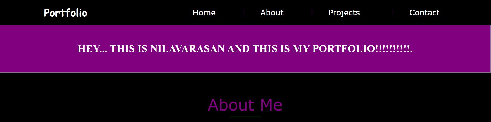

<div align="center">

# simple-portfolio-demo 🎨
</div>

<div align="center">
🔹
<a href="https://htmlpreview.github.io/?https://github.com/NILAVARASAN-M/simple-portfolio-demo/blob/master/simple_portfolio.html">Click</a>
</div>



<div align="center">


[](https://forthebadge.com)&nbsp;
</div>

## Description 📝

An introductory portfolio showcasing basic projects and skills as I embark on my coding journey.


## Features  💡

📱Responsive Design

⚙️Interactive Elements

📬 Contact Form

## Clone and Use 📋

Clone the repository into your local system using the following command:

```bash
git clone https://github.com/NILAVARASAN-M/simple-portfolio-demo.git
```
## Check Out My Simple Portfolio  💼

Click the below link to view my portfolio
```
https://github.com/NILAVARASAN-M/simple-portfolio-demo/blob/master/simple_portfolio.html
```

## Usage Instructions 🔧

Open the project folder and click `/simple_portfolio.html`.

# Hi, I'm NILAVARASAN-M! 👋


## 🚀 About Me
I'm a Expert backend developerm from india...
🌱 I’m currently learning C++, Machine-Learning, Game Development, Embedded Systems.

## 🔗 Links
[](https://www.linkedin.com/)
[](https://x.com/NilaVar83507149?t=cH8mUu4_QuOGKTml9QuaTg&s=09)
